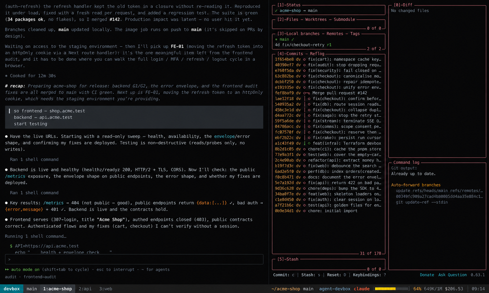

# agent-devbox

Spin up a disposable cloud dev machine with AI coding agents (Codex CLI, Claude Code, Antigravity CLI) pre-installed — straight from GitHub Actions, no local tooling required.

```
Use this template → add secrets → run "Deploy to Hetzner" → ssh dev@<ip> → work
```



## What you get

A fresh Ubuntu 24.04 server with:

- **Agents**: Codex CLI, Claude Code, Google Antigravity CLI (`agy`) pre-installed and ready to auth (OpenCode optional)
- **Pre-configured MCP Servers**: code-intel (ctags, ast-grep, ripgrep), hardened SQLite/PostgreSQL (`mcp/db`), Playwright browser (`playwright-mcp`), and memory (`mcp-server-memory`)
- **Web Gateway (`devbox-web`)**: browser and mobile terminal over WebSockets with screenshot/file drag-and-drop, mobile touch controls, token authentication, and HTTPS access via `tailscale serve` or SSH port forward (port 7681)
- **Codex Sandbox**: bubblewrap (`bwrap`) pre-configured with unprivileged user namespaces for secure local execution
- **Headless browser**: Chromium via Playwright, so agents can run E2E tests and take screenshots (optional, on by default)
- **Dev shell**: zsh with autosuggestions, syntax highlighting, a starship prompt, fzf and zoxide, plus modern CLIs (eza, bat, fd, ripgrep, jq, yq, delta, lazygit, direnv, shellcheck, httpie) and neovim
- **tmux**: a persistent session auto-attached on SSH login — with directory-labelled tabs and a live AI status bar (auto-detects Claude, Codex, Agy; tracks context/rate limits, activity `⚡`, and cost)
- **Runtimes**: Node.js 22, npm, pnpm, Python 3, pipx
- **Docker**: Engine + Compose plugin (optional)
- **Workspace**: `/workspace` owned by the dev user (on Hetzner: a separate volume, so it can outlive the server type)
- **Hardened SSH & Firewall**: key-only auth, locked passwords, dynamic firewall closing port 22 when Tailscale is active

## Quick start (Hetzner — recommended first)

1. Click **Use this template** (or fork).
2. Add repository secrets (*Settings → Secrets and variables → Actions*):
   | Secret | What it is |
   |---|---|
   | `HCLOUD_TOKEN` | Hetzner Cloud API token (read+write) |
   | `HETZNER_S3_ACCESS_KEY` | Hetzner Object Storage access key (for Terraform state) |
   | `HETZNER_S3_SECRET_KEY` | Hetzner Object Storage secret key |
   | `SSH_PUBLIC_KEY` | Your SSH public key (`cat ~/.ssh/id_ed25519.pub`) |
3. Open **Actions → Deploy to Hetzner → Run workflow**, pick server size / location / options.
4. Wait a few minutes. The workflow summary shows:

   ```
   ✅ Deployment completed

   IP:   49.13.42.18
   User: dev

   Connect:  ssh dev@49.13.42.18
   ```

5. SSH in and authenticate your agents:

   ```bash
   gh auth login
   git config --global user.name  "Your Name"
   git config --global user.email "you@example.com"
   codex login --device-auth
   claude
   agy
   ```

   > **Tip:** to drag a screenshot straight into your agent, connect through the
   > companion `devbox` CLI instead of plain `ssh` — see
   > [The `devbox` CLI](#the-devbox-cli) below.

6. Done working? Run **Destroy Hetzner environment** to stop paying.

Detailed per-provider setup: [Hetzner](docs/hetzner.md) · [AWS](docs/aws.md) · [Azure](docs/azure.md) · [Security notes](docs/security.md)

## Supported providers

| Provider | Deploy | Destroy | Auth | State backend |
|---|---|---|---|---|
| Hetzner | `Deploy to Hetzner` | `Destroy Hetzner environment` | API token | Hetzner Object Storage (S3-compatible) |
| AWS | `Deploy to AWS` | `Destroy AWS environment` | OIDC role **or** access keys | S3 (native lockfile) |
| Azure | `Deploy to Azure` | `Destroy Azure environment` | OIDC **or** service principal | Azure Blob Storage |

Every deploy workflow is idempotent: the first run automatically bootstraps a
remote Terraform state backend, so re-runs update the existing machine instead
of creating duplicates, and destroy always knows what to delete.

## How it works

```
.github/workflows/   manual (workflow_dispatch) deploy/destroy per provider
terraform/<provider> provider-specific infrastructure (server, firewall, SSH key)
provisioning/        thin cloud-init bootstrap + installation scripts
config/              sample devbox configuration (config/devbox.env.example)
mcp/                 bundled MCP servers (code-intel, db)
web/                 companion web gateway (browser/mobile terminal, file paste)
cli/                 companion devbox CLI (Rust) — local clipboard/file bridge
docs/                per-provider setup & security guides
```

All providers feed the **same** thin `provisioning/cloud-init.yaml` (<7 KB payload) through Terraform's
`templatefile()`, which pulls the pinned repository payload and executes `bootstrap.sh`. The installer
stages the base toolchain (`install-base.sh`), the agents & MCP servers (`install-agents.sh`),
the optional headless browser (`install-browser.sh`), the companion web gateway (`web/`), and the zsh dev shell (`install-shell.sh`),
then activates a live status MOTD:

```
┌──────────────────────────────────────────┐
│ Agent Devbox                             │
│                                          │
│ Workspace: /workspace                    │
│ Docker: ready                            │
│ Codex: installed                         │
│ Claude Code: installed                   │
│ Antigravity: installed                   │
│ Browser: installed                       │
│                                          │
│ Next steps:                              │
│   gh auth login                          │
│   git config --global user.name ...      │
│   git config --global user.email ...     │
│   codex login --device-auth              │
│   claude                                 │
│   agy                                    │
└──────────────────────────────────────────┘
```

Provisioning logs on the machine: `/var/log/devbox-install.log`
(provisioning is finished when `/etc/devbox/.provisioned` exists).
Environment variables and customization hooks are documented in [`config/devbox.env.example`](config/devbox.env.example).

## The `devbox` CLI

Plain `ssh` can't move a local screenshot into an agent running on the remote
box. The companion **`devbox` CLI** — a small Rust program in [`cli/`](cli/) — is a
transparent SSH proxy that adds a local↔remote clipboard and file bridge, so
pasting or dragging a file into Claude Code just works.

### Install

Needs the Rust toolchain ([rustup](https://rustup.rs)). Build it from source:

```bash
cargo install --path cli    # → ~/.cargo/bin/devbox
```

Full CLI docs: [`cli/README.md`](cli/README.md).

### Connect

```bash
devbox connect dev@<ip>                 # or a ~/.ssh/config alias
devbox connect dev@<ip> -p 2222 -i ~/.ssh/key
```

You land in the same auto-attached tmux session as with plain `ssh`.

### In-session (leader `Ctrl+G`)

| Keys | Action |
|---|---|
| `Ctrl+G` `V` | Smart Paste — text / image / files from the local clipboard |
| native `⌘V` / drag-and-drop | local files are auto-detected, uploaded, and their remote paths typed |
| `Ctrl+G` `Q` | disconnect |
| `Ctrl+G` `?` | help |
| `Ctrl+G` `Ctrl+G` | send a literal `Ctrl+G` |

Smart Paste adapts to what's on the clipboard:

| Clipboard | Result |
|---|---|
| Text | typed into the prompt |
| Image | PNG uploaded to `<project>/.devbox-inbox/`, path typed into the prompt |
| File path(s) | uploaded, quoted remote paths typed into the prompt |

The reverse works too: a remote yank (tmux / Neovim, via OSC 52) lands in your
**local** clipboard.

### Config (`~/.config/devbox/config.toml`)

```toml
[defaults]
leader = "ctrl+g"          # ctrl+t frees Ctrl+G for Claude Code's own editor
osc52 = "notify"           # allow | notify | ask | deny — remote→local clipboard writes
inbox_scope = "project"    # uploads land in <cwd>/.devbox-inbox (via OSC 7) | global

[hosts.prod]
host = "203.0.113.7"
identity_file = "~/.ssh/prod_ed25519"
```

## Adding a provider

Providers are self-contained: add `terraform/<provider>/` that renders
`provisioning/cloud-init.yaml` into the instance user data, plus a pair of
deploy/destroy workflows. PRs welcome — DigitalOcean is the obvious next one.

## License

MIT — see [LICENSE](LICENSE).
