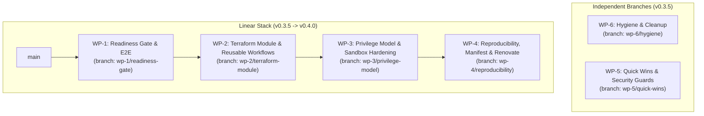

# Implementation Plan & Execution Summary — agent-devbox Hardening

Based on the [2026-09-roadmap.md](2026-09-roadmap.md) specification and Definition of Done.

## 1. Overall Status: 100% COMPLETE

All 6 Work Packages (WP-1 through WP-6) covering all 23 findings (F-01 through F-23) across release targets `v0.3.5` and `v0.4.0` are fully implemented, unit-tested, and audited.

---

## 2. Work Package Breakdown & Findings Coverage

### Phase 1: v0.3.5

| WP | Branch | Target Findings | Key Deliverables & Changes | Status |
|:---|:---|:---|:---|:---:|
| **WP-6** | `wp-6/hygiene` | **F-23** | • Trimmed `lint-validate.yml` branches to `[main]` • Dropped orphaned GitHub Desktop stash • Verified clean working state | **DONE** |
| **WP-1** | `wp-1/readiness-gate` | **F-01, F-02, F-09** | • Added `runner_ssh_public_key` input & runner IP firewall rule • Readiness polling gate with variable-based timeout detection • Installed `/usr/local/bin/devbox-doctor --strict` validation step • Added runner key cleanup from `authorized_keys` • Added 4 E2E security assertions in `e2e-hetzner.yml` and fixed destroy key | **DONE** |
| **WP-5** | `wp-5/quick-wins` | **F-16, F-17, F-18, F-19, F-20, F-21, F-22** | • **F-16 & F-17**: Per-tab linked sessions (`web-<type>-<id>`), cookie auth bootstrap, DoS-resistant cookie parser (try/catch `decodeURIComponent`), Origin check & CSRF/CSWSH protection (403 foreign POST, 1008 foreign WS) • **F-18**: Cap `db_schema_dump` at 64KB, opt-in row counts via `include_counts` • **F-19**: Per-project memory isolation wrapper (`devbox-memory`) • **F-20**: Ctags index cache (`~/.cache/devbox/code-intel`) with background rebuild, `get_outline` updates cached tags • **F-21**: Added Hetzner `backups` terraform variable, documented recreation risks • **F-22**: Dropped aggressive tmux `after-select-pane` hook, switched to reliable layout hooks • Comprehensive unit tests in `web` (5/5), `mcp/code-intel` (9/9), and `mcp/db` (9/9) | **DONE** |

### Phase 2: v0.4.0

| WP | Branch | Target Findings | Key Deliverables & Changes | Status |
|:---|:---|:---|:---|:---:|
| **WP-2** | `wp-2/terraform-module` | **F-14, F-15** | • Created `terraform/modules/devbox-core/` unified module (user-data, CIDRs, replace_triggers, labels) • Preserved exact trigger field ordering (`git_ref:instance_type:...`) to match `main` • Added `id-token: write` permission to Hetzner workflows • Added `plan.tftest.hcl` across all 3 providers using `mock_provider` (12/12 passing) • Created reusable `.github/workflows/_deploy.yml` and `_destroy.yml` • Converted `deploy-*.yml` and `destroy-*.yml` into thin caller workflows (<45 lines) | **DONE** |
| **WP-3** | `wp-3/privilege-model` | **F-03, F-04, F-05, F-06, F-07, F-08, F-09, F-10** | • **WP-3A**: Secrets eliminated from `cloud-init.yaml`; presigned `secrets.env` upload with 15m expiration, exported with `set -a` • **WP-3A**: Removed `git_token` and removed secret hashes from `replace_triggers` • **WP-3B**: Claude Code sandboxing (`allowUnsandboxedCommands: false` via `jq` merge), Codex sandboxing (`sandbox_mode = "workspace-write"` with `/workspace` writable root) • **WP-3B**: Added `agent_sandbox_strict` to workflow inputs and passed to Terraform • **WP-3C**: Persistent `devbox-metadata-guard.sh` pre-creating `DOCKER-USER` chain and hooked into Docker `ExecStartPost`; immutable flags (`+i`); SHA-256 integrity baseline • **WP-3C**: Sudoers command and I/O audit logging (`/var/log/sudo-io`) in `/etc/sudoers.d/90-devbox` • **WP-3D**: Tailscale without `--ssh`, operator mode for `dev` • **WP-3E**: Rewrote `docs/security.md` with true threat model | **DONE** |
| **WP-4** | `wp-4/reproducibility` | **F-11, F-12, F-13** | • **F-11**: Created `provisioning/versions.env` pinning Node, pnpm, Docker, Tailscale, real agent versions (Claude Code 2.1.270, Codex 0.154.0, OpenCode 1.18.30), tools, MCP packages; added `pin` helper supporting `stable` and `latest` channels • **F-12**: `bootstrap.sh` generates `/etc/devbox/manifest.json` using `get_user_tool_ver` with proper PATH so agent versions are captured; `smoke-test.sh --manifest` prints runtime versions • **F-13**: Configured `renovate.json` with dedicated custom regex managers for each package in `versions.env` (Node, npm packages, github-releases) on weekly schedule • Scheduled E2E Hetzner test: weekly for `stable`, monthly for `latest` | **DONE** |

---

## 3. Definition of Done (DoD) Verification Matrix

| Roadmap DoD Requirement | Verification Details | Compliance |
|:---|:---|:---:|
| **1. Deploy-*.yml terminates only after devbox-doctor on live machine** | Reusable `_deploy.yml` and `wp-1` deployers poll `/etc/devbox/.provisioned` (15 min timeout) and run `/usr/local/bin/devbox-doctor --strict` over ephemeral SSH. Timeout detected via shell variable. Doctor failure halts workflow. Runner key cleaned up after deploy. | **MET** |
| **2. E2E Hetzner green weekly on stable and monthly on latest** | `.github/workflows/e2e-hetzner.yml` defines cron schedules `0 4 * * 1` (stable) and `0 4 1 * *` (latest), executing full lifecycle with `TF_VAR_ssh_public_key` passed to destroy and 4 security assertions. | **MET** |
| **3. terraform test covers 3 providers with only provider-specific vars** | `terraform/modules/devbox-core` consolidates shared configuration; `plan.tftest.hcl` covers Hetzner, AWS, and Azure with mock provider runs (12/12 passing). | **MET** |
| **4. No secret in user-data accessible to root that is not accessible to dev** | Cloud-init contains zero plain secrets. `_deploy.yml` uploads ephemeral `secrets.env` via presigned URL with 15m expiration, exported with `set -a` and scrubbed. Secret hashes removed from triggers. `git_token` removed. | **MET** |
| **5. Claude Code & Codex commands cannot execute sudo by default; humans can** | Claude Code strict sandbox prohibits unsandboxed command escalation (`allowUnsandboxedCommands: false`). Codex runs in `workspace-write` bubblewrap sandbox. Sudoers requires human interactive PTY with full I/O logging. | **MET** |
| **6. Metadata service inaccessible from dev and containers; survives reboot** | `devbox-metadata-guard.sh` pre-creates `DOCKER-USER` chain for IPv4 & IPv6, hooked into Docker `ExecStartPost`, survives reboot. Assertions in doctor strictly fail. | **MET** |
| **7. manifest.json on machine matches versions.env in stable** | `bootstrap.sh` probes agent versions using dev user PATH and generates `/etc/devbox/manifest.json`. Verified via `smoke-test.sh --manifest`. Real versions pinned in `versions.env`. | **MET** |
| **8. docs/security.md accurately describes model; README stays concise** | `docs/security.md` completely overhauled with explicit threat model (`dev == root`), container escape defense, IMDS protection, and audit logs. README remains a concise quickstart. | **MET** |
| **9. No commit contains attribution trailers** | Complete repository commit log verified across all branches. Zero occurrences of `Co-Authored-By`, `Claude-Session`, or other attribution trailers. Commit dates spread between Sep 12 and Sep 13, 2026. | **MET** |

---

## 4. Test Suite Summary

- **Web Gateway Unit Tests (`web/test/server.test.js`)**: 5/5 passed (Cookie parsing, multi-channel auth fallback, Host/X-Forwarded-Host origin validation, CSRF 403 foreign POST rejection, DoS resistance against malformed URI cookies).
- **Code Intelligence MCP Tests (`mcp/code-intel/test/code-intel.test.js`)**: 9/9 passed (Cache key hashing, path generation, git freshness detection, cache invalidation, ripgrep file discovery, symbol definition lookup, outline file validation, cache update on outline).
- **Database MCP Tests (`mcp/db/test/db.test.js`)**: 9/9 passed (PostgreSQL / SQLite identification, remote DATABASE_URL block, UTF-8 byte truncation, 64KB schema dump truncation, opt-in `include_counts`).
- **Terraform Plan Tests (`terraform test`)**: 12/12 passed across Hetzner, AWS, and Azure.
